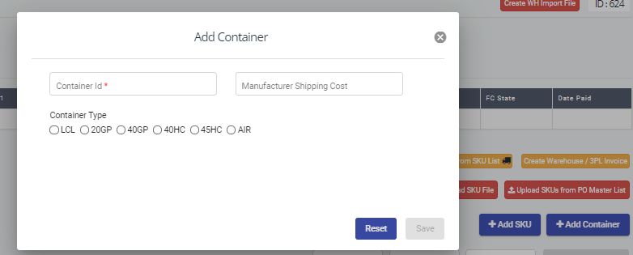
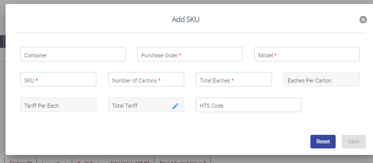
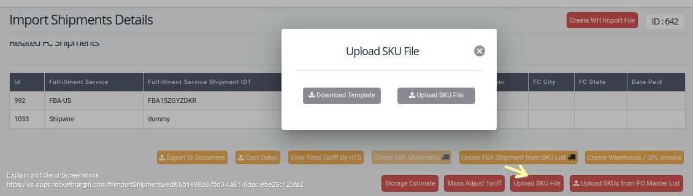
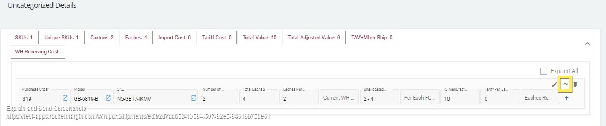
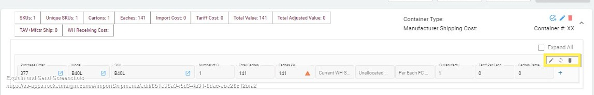
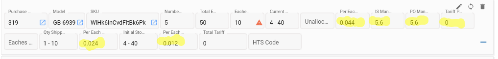

## Import Shiments
Import Shipments screen helps the user to capture all the details when the products are imported from manufacturer country to the target country where the products are going to be sold.
We can add the documents, invoices, and all the product details related to a particular shipment in Import Shipments UI
###### Adding Documents
Documents can be added by providing the 'Document Type' first and then browse the document. Follwoing are the different types of documents which can be added in IS page
1. BOL(bill of lading)
2. Commercial Invoice
3. ISF1(Importer Security Filing)
4. ISF2
5. Local Charges
6. Packing List
7. Tariff Docs
8. Other
Maximum of one file can be uploded for all types of docs. If the file is of type 'Other' then the type can be specified in 'Other Value'

Invoices for an import shipment can be listed under Invoice Details and the system shows these cost in sku level. Following types of invoices can be added in the IS page
1. Forwarder
2. Warehouse 3PL
3. Clearing Agent
4. Duty Payment
5. Other

SKU Details
All the products and how much qty are shipping in the container for this shipment for each product, details like this can be given under SKU details
SKU can be given inside the container if the product is shipped in a container or SKU can be given without a container. Container details can be given by 'Add Container' option where the container id, type and the manufacturer shipping cost for the products in that container can be given



###### How to add a product into an IS

To add the product details of an import shipment. Products can be added by following different ways

1. Using 'Add SKU' from UI
 
We can add sku as one by one by clicking on 'Add SKU' button. See the button in the following screenshot 



 - Container id can be selected if product is shipping via container. Purchase Order is the id of purchase order created before from which the inventory is shipped
 - Model and SKU are the product details created in that PO
 - Number of Cartons is the required number of cartons to ship the product from manufacturer country to the seller's country
 - Total Eaches is the number of units of product shipping in the shipment
 - Eaches Per Carton is an auto-filled field ie Total Eaches/Number of Cartons and it should be always an integer value. If this value differs from the previous import shipment then there will be a warning symbol will be displayed for notifying the user. See the screenshot below


	
	
 - HTS Code also called as Tariff code which is a predefined set of codes based on the source and target country of a product. If this code is saved on the sku details page then HTS Code will automatically gets set in the IS page. Else we need to select it from this drop down

 - Tariff Per Each and Total Tariff are the tariff cost of the product based on the selected tariff code
    ```sh
    Tariff Per Unit = Manufacture Price * Tariff rate %
    Total Tariff = Tariff Per Unit * Total Unit Quantity
    ```
2. Using 'Upload SKU'

The previous option will be helpful when the number of prducts are very less. There is an option in the IS page to upload the SKU file after filling the SKU information in the template file we are provided. The template can be downloaded from UI itself by 'Download Template' button.



3. Using 'Upload SKUs from PO master list'

It is an option to upload SKUs directly using the file, 'PO by SKU Master List'. Download the file from PO list page, fill the necessary information for only the SKUs which are to be created in IS page and upload using this button


###### SKU level actions
Once the SKU is added into an IS, the folllowing actons are possible

1. Edit SKU where product details can be edited
2. Reassign SKU, products container can be reassigned to another container
3. Delete SKU, product can be removed from IS

If the product is created outside the container/uncategorized then there will be 'Assign' option to assign to an existing container instead of Reassign option as seen below



###### Container level actions
After creating one container and product information under the container we can do the following actions

1. Edit Container, edit the container id/container type/manufacturer shipping cost
2. Delete Container, Delete Container will ask us whether we want to delete the container as whole ie including all products of that container or delete only the container not products. In the second case the products be moved under Uncategorized section
3. Create Storage Inventory Group, option to create the storage inventory group directly from IS page. The SIG contains the product details which are directly moved to a particular warehouse from the container which is shipped to the target country. It is not allowed to create multiple SIGs from a container. Once the SIG is created then navigation link to that SIG will be shown here. The following are the SKU level fields which will get effected when a SIG is created from a container
    a) Initial Storage Quantity
        The quantity of the product in the warehouse when it is moved for storage
    b) Current WH Storage Qty
        The current quantity of product in the warehouse. This value gets decreased each time a fulfillment is created from the SIG
    c) Unallocated Qty
        The remaining quantity of product in the IS after creating the SIG/FC for a product



All the above quantity are shown in the 'Carton - Number of Eaches' format on the UI

**Manufacturing Cost for the product**

Two types of manufacturing costs are available for a product

1. PO Manufacturing Cost

    Price Per Unit from the source PO
2. IS Manufacturing Cost

    This is the cost after applying the pegged rate when currency fluctuations occur

    ```sh
    SKU's IS.Manufacturing Cost = (IS.SKU's PO.Manufacturing Cost*Pegged rate) * ( 1/Current rate)
    If Manufacturer has given any discount then apply the discount and find the new manufacturing cost
    SKU's IS.Manufacturing Cost = SKU's IS.Manufacturing Cost - (SKU's IS.Manufacturing Cost * discount %)
    ```
**Import Cost**

The cost of the product while shipping from manufacturer country to the country where the product is going to be sold which includes the cost comes under the invoices of types such as 'Forwarder', 'Clearing agent', 'Duty payment' and 'Other' after deducting the tariff cost. The total import cost will be calculated and distributed to SKU level based on the product's master carton dimensions.

```sh
Total Cost = [Invoice Cost + Manufacturer Shipping Cost - Tariff Cost (If 'Deduct Tariff Costs is checked)]

Calculate Per Each Import Cost based on SKU CBM and Total Eaches as follows,
SKU1's CBM = MasterCartonLength(meter) * MasterCartonHeight(meter) * MasterCartonWidth(meter)
SKU1's Total Carton CBM = SKU1's CBM * No of Cartons
SKU1's Total Carton CBM % = SKU1's Total Carton CBM / (SKU1's Total Carton CBM + SKU2's Total Carton CBM)
Tot IS Ship Cost for SKU1 = Total Cost * SKU1's Total Carton CBM %
```
**Cost of FC Shipment**

The cost of inventory of a product shipped from the IS to the FC. The cost includes cost of direct shipment from IS to the FC and cost of indirect shipment ie from IS to the warehouse and then to the FC. In the first case the 'Qty Shipped Direct to the FC's will also get updated.

```sh
(IS.FC.SKU.ShipCost+IS.SIG.FC.ShipCost) / SUM(Total Eaches)
```

**Warehouse Invoice Cost**

Cost of warehouse preparation cost for the inventory attached to the IS directly or indirectly. Need to consider all WHInvoice cost for an SKU in that IS connected directly or indirectly
```sh
Per Each WH InvoiceCost = SUM (Per Unit 3PL Invoice Cost of IS.SKU + Per Unit 3PL Invoice Cost of SIG.SKU + Per Unit 3PL Invoice Cost of FC.SKU)
```
See the following screenshot where we can see all the above mentioned costs



**Storage Estimate**

Shows the estimated number of pallets required to store the products in the IS
```sh
Cubic Ft = SKU's Master Carton Length* Master Carton Height* Master Carton Width/1728 * No of Cartons
Estimated Pallets  = Cubic Ft / (40 * 48 * Max Pallet Height /1728) ---> rounds to next integer value
'Max Pallet Height'  should be configurable from 'Prep Center /Warehouse' and Settings-->General
```
**Mass Adjust Tariff**

The Tariff can be calculated while uploading Mass Adjust file in the following steps

1. Download Template

Using this template, we can give the inputs for calculating tariff for the given SKU. The SKU/Model number can be given as an Identifier

2. Upload Adjustment File

The SKU with the values given in the file will get filled in the UI. The values get filled only if those SKUs are already present in the UI

**View Total Tariff By HTS Code**

Helps to view the tariff cost based on the HTS code used in the import shipment. 
This view contains 6 columns such as HTS code, Tariff %, Total Reported Value, Tariff Costs, MPF(Merchandise Processing Fee), HMF(Harbor Maintenance Fee) and Total Tariff Costs

Tariff % is based on the Tariff code ie The latest Tariff code modified before the Inventory-->ETA
```sh
Tariff Costs = Sum of Tariff Costs for a HTS code(Tariff Cost for single SKU row = Total Reported Value * Tariff %)
MPF = .3464 % of Total Reported Value
HMF = .125 % of Total Reported Value

If the file is provided only Reported Unit Value then
Reported Total Value = Reported Unit Value  * Total Unit Quantity
Total Tariff Costs = Tariff Costs + MPF + HMF
```
Following are the different scenarios for calculating Total Tariff and Reported Value while uploading the mass adjust file. 

- When the identfier(SKU/Model Number) repeats in mass adjust file

	1. Sum the Reported Total Value for the repeated SKU/Model Number for a container and round it to an integer value. 
	
	2. Find the Total Tariff costs based on the Total Reported value

	3. Find SKU1's Reported Value % and SKU2's Reported Value % as follows,
	SKU1's Reported Value% = SKU1's Reported Val / (SKU1's Reported Val + SKU2's Reported Val)
	SKU1's Total tariff = Total Tariff * SKU1's Reported Value %	

- When the Identifier(SKU/Model Number) repeats in UI- Container(Same SKU from different PO)

    Read Total Reported Value for a SKU from Mass adjust file and distribute among these repeated SKUs in a container based on its Total Unit Qty and find the Total Tariff costs based on the distributed Total Reported Value

Note: In either of the above case the HTS code should be same for all the repeated SKUs/Model Number. Else the Error message should be displayed to the user

**Export IS Document**

The SKU details of an import shipment can be exported as a document which contains all SKUs and all the fields with the values comes in the SKU row

**Cost Detail**

The cost details of the Import Shipment can be exported as a document/report
The report contains top rows such as
1. Pegged Rate
2. Current Rate
3. Manufacturer's Discount
4. HBL
5. Container's ID

Then the report contains details for,

1. SKU
2. Model
3. Description
4. Number of Cartons
5. Eaches Per Carton
6. Total Eaches
7. Manufacture Cost --> po. manufacturecost
8. Total Cost = manufacture cost * total eaches
9. Pegged Rate Cost = total cost * pegged rate (2 decimal places rounded)
10. Current Rate Cost = pegged rate cost * 1/current rate(2 decimal places rounded)
11. Cost After Discount = current rate cost - [current rate cost * manufacturers discount rate]

Summary rows are, 

1. Manufacturers Shipping Cost = Container.manufacturing shipping cost
2. Grand Total  = Cost After Discount + Manufacturers Shipping Cost

**Create Warehouse/3PL Invoice**

Warehouse preparation cost be added from IS using this button which navigates the user directly to the Warehouse/3PL Invoice page

**Create WH Import File**

Helps to create a document of list of SKUs to send to a particular warehouse based on the selected warehouses template. By default the warehouse selected in the popup will be the same given in the import shipment page
